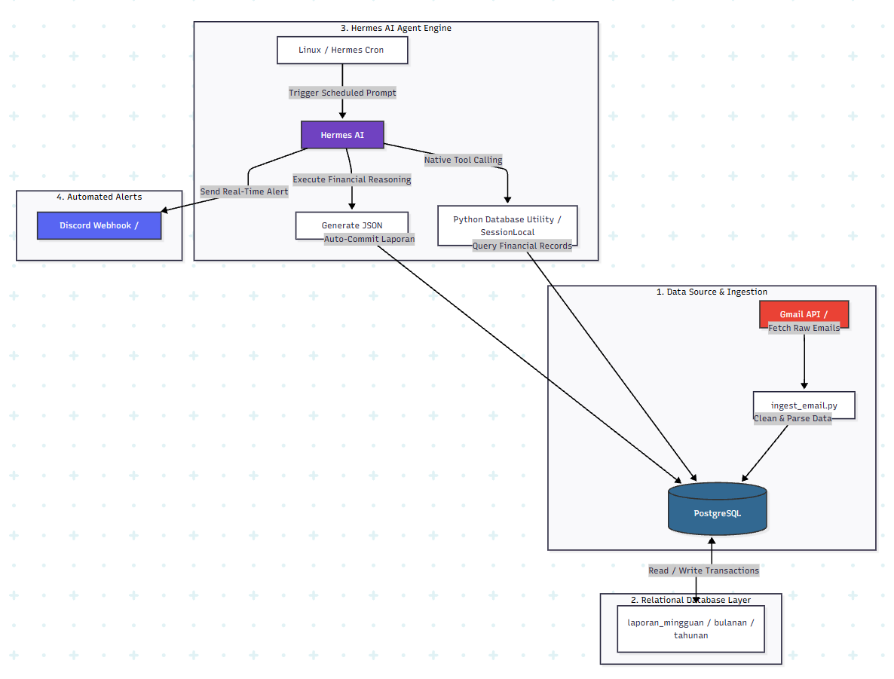

dapetin credentials
```
https://console.cloud.google.com/
```

install 
```

pip install google-api-python-client google-auth-httplib2 google-auth-oauthlib
```

penjelasannya masih dibuat, nanti akan diupdate readme nya hehe. sementara pake penjelasan gambar dibawah ini dulu:



buat simpen log transaksi tinggal bikin dulu credentialnya, terus dapetin tokennya. bikin databasenya. jangan lupa isi .env
abis itu udah deh tinggal running ```ingest_email.py```. selebihnya, masih dibikin penjelasannya 